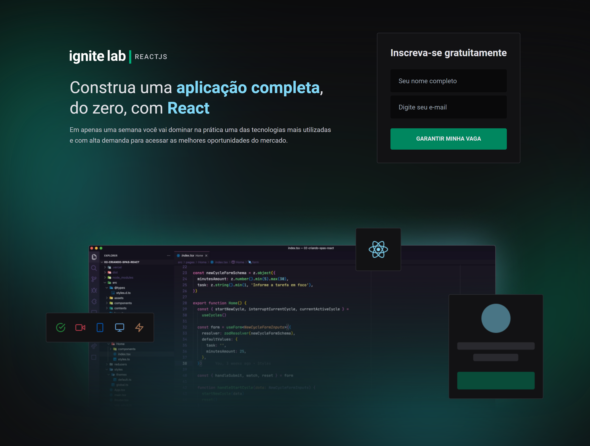
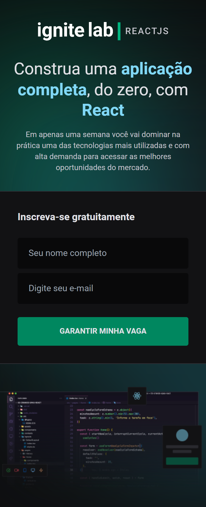

# Ignite Lab

Exercício do Ignite Lab ministrado pela Rocketseat.

## Screenshots

## Links

Link: https://ignite-lab-react-three.vercel.app/

## Aprendizados

Uso e aplicação do Typescript, criação e consumo de API com GraphCMS e GraphQL.

## Construído com

-   Typescript 
-   React
-   GraphQL
-   GraphCMS
-   React
-   Tailwind
-   ApolloClient

## Autores

-   [@Mveryy](https://github.com/Mveryy)
